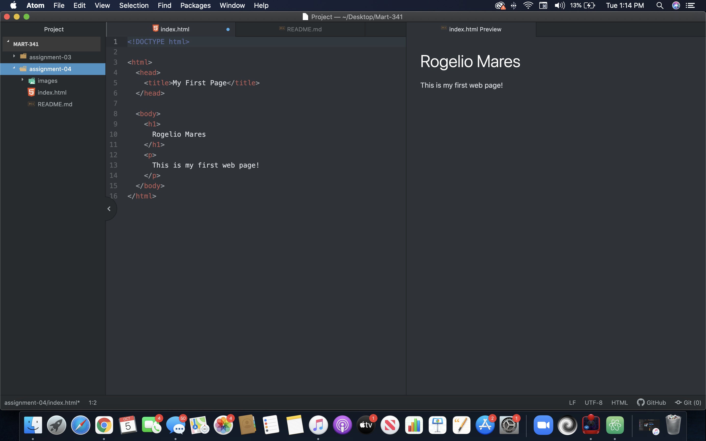

# Assignment 4

• Very briefly detail how browsers function. List any browsers you currently use to surf - or even develop
for - the web.

Th main task of a browser is to collect information and from the internet and make it available to everyone. The browser application converts content such as HTML, CSS, and images to a file in a process called rendering. In this process the browsers can display content such as videos, images, hyperlinks, text, etc.

• What is a markup language? Describe one commonly used in development.

Markup languages are used to describe how a particular set of data should be represented on a web document. A commonly used markup language is HTM.

## Screenshot

