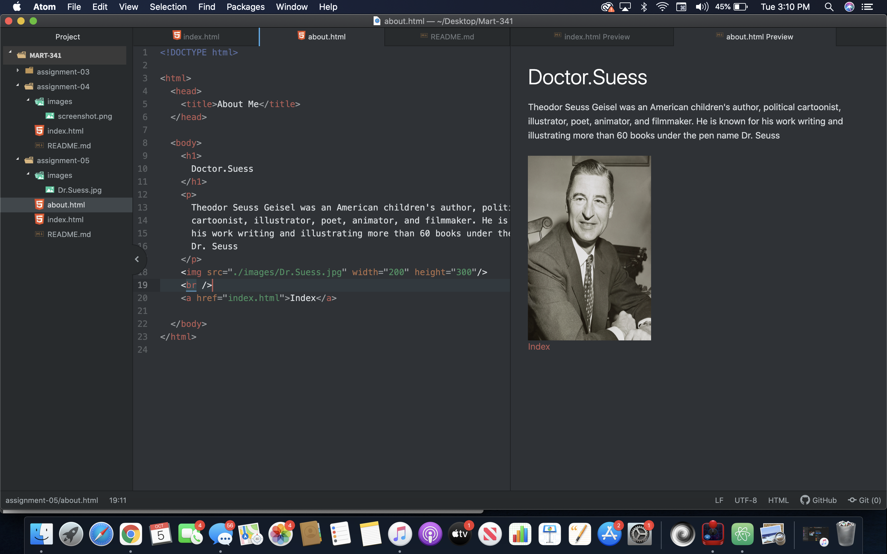

1. Visit a site using The Wayback Machine, looking at a snapshot at least 10 years old. Where did you go? What did it look like? How has it changed?

  The sight I used was devaintart.com, it looked like a really old website even though it was made in 2013. It looks like it was a website i could probably make by the end of this semester.Looking a the one now you can tell how much it has improved and how natural the website looks.
2. Summarize your experience with these last few topics. What did you learn? What was difficult, easy, or still misunderstood?

  I felt like the last few topics were easy to learn. But I feel like having some video tutorials would've made the assignment easier to follow. All though i think everything we have learned so far was pretty standard and easy.

## Screenshot

